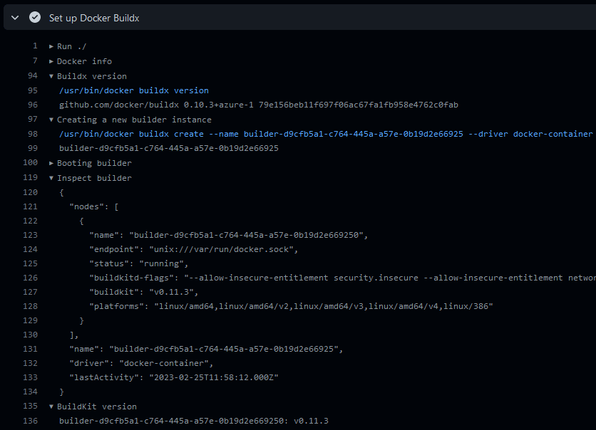

[](https://github.com/docker/setup-buildx-action/releases/latest)
[](https://github.com/marketplace/actions/docker-setup-buildx)
[](https://github.com/docker/setup-buildx-action/actions?workflow=ci)
[](https://github.com/docker/setup-buildx-action/actions?workflow=test)
[](https://codecov.io/gh/docker/setup-buildx-action)

## About

GitHub Action to set up Docker [Buildx](https://github.com/docker/buildx).

> :bulb: See also:
> * [login](https://github.com/docker/login-action) action
> * [setup-qemu](https://github.com/docker/setup-qemu-action) action
> * [build-push](https://github.com/docker/build-push-action) action



___

* [Usage](#usage)
  * [Quick start](#quick-start)
  * [With QEMU](#with-qemu)
  * [Install by default](#install-by-default)
* [Customizing](#customizing)
  * [inputs](#inputs)
  * [outputs](#outputs)
  * [environment variables](#environment-variables)
* [Keep up-to-date with GitHub Dependabot](#keep-up-to-date-with-github-dependabot)
* [Limitation](#limitation)

## Usage

### Quick start

```yaml
name: ci

on:
  push:

jobs:
  buildx:
    runs-on: ubuntu-latest
    steps:
      -
        name: Checkout
        uses: actions/checkout@v2
      -
        name: Set up Docker Buildx
        id: buildx
        uses: docker/setup-buildx-action@v1
      -
        name: Builder instance name
        run: echo ${{ steps.buildx.outputs.name }}
      -
        name: Available platforms
        run: echo ${{ steps.buildx.outputs.platforms }}
```

### With QEMU

If you want support for more platforms you can use our [setup-qemu](https://github.com/docker/setup-qemu-action) action:

```yaml
name: ci

on:
  push:

jobs:
  buildx:
    runs-on: ubuntu-latest
    steps:
      -
        name: Checkout
        uses: actions/checkout@v2
      -
        name: Set up QEMU
        uses: docker/setup-qemu-action@v1
      -
        name: Set up Docker Buildx
        id: buildx
        uses: docker/setup-buildx-action@v1
        with:
          version: latest
      -
        name: Available platforms
        run: echo ${{ steps.buildx.outputs.platforms }}
```

### Install by default

Implemented with https://github.com/docker/buildx#setting-buildx-as-default-builder-in-docker-1903

```yaml
name: ci

on:
  push:

jobs:
  buildx:
    runs-on: ubuntu-latest
    steps:
      -
        name: Checkout
        uses: actions/checkout@v2
      -
        uses: docker/setup-buildx-action@v1
        id: buildx
        with:
          install: true
      -
        name: Build
        run: |
          docker build . # will run buildx
```

## Customizing

### inputs

Following inputs can be used as `step.with` keys

| Name               | Type    | Description                       |
|--------------------|---------|-----------------------------------|
| `version`          | String  | [Buildx](https://github.com/docker/buildx) version. (eg. `v0.3.0`, `latest`) |
| `driver`           | String  | Sets the [builder driver](https://github.com/docker/buildx#--driver-driver) to be used (default `docker-container`) |
| `driver-opts`      | CSV     | List of additional [driver-specific options](https://github.com/docker/buildx#--driver-opt-options) (eg. `image=moby/buildkit:master`) |
| `buildkitd-flags`  | String  | [Flags for buildkitd](https://github.com/moby/buildkit/blob/master/docs/buildkitd.toml.md) daemon (since [buildx v0.3.0](https://github.com/docker/buildx/releases/tag/v0.3.0)) |
| `install`          | Bool    | Sets up `docker build` command as an alias to `docker buildx` (default `false`) |
| `use`              | Bool    | Switch to this builder instance (default `true`) |
| `endpoint`         | String  | [Optional address for docker socket](https://github.com/docker/buildx#buildx-create-options-contextendpoint) or context from `docker context ls` |

> `CSV` type must be a newline-delimited string
> ```yaml
> driver-opts: image=moby/buildkit:master
> ```
> ```yaml
> driver-opts: |
>   image=moby/buildkit:master
>   network=host
> ```

### outputs

Following outputs are available

| Name          | Type    | Description                           |
|---------------|---------|---------------------------------------|
| `name`        | String  | Builder instance name |
| `platforms`   | String  | Available platforms (comma separated) |

### environment variables

The following [official docker environment variables](https://docs.docker.com/engine/reference/commandline/cli/#environment-variables) are supported:

| Name            | Type    | Default      | Description                                    |
|-----------------|---------|-------------|-------------------------------------------------|
| `DOCKER_CONFIG` | String  | `~/.docker` | The location of your client configuration files |

## Keep up-to-date with GitHub Dependabot

Since [Dependabot](https://docs.github.com/en/github/administering-a-repository/keeping-your-actions-up-to-date-with-github-dependabot)
has [native GitHub Actions support](https://docs.github.com/en/github/administering-a-repository/configuration-options-for-dependency-updates#package-ecosystem),
to enable it on your GitHub repo all you need to do is add the `.github/dependabot.yml` file:

```yaml
version: 2
updates:
  # Maintain dependencies for GitHub Actions
  - package-ecosystem: "github-actions"
    directory: "/"
    schedule:
      interval: "daily"
```

## Limitation

This action is only available for Linux [virtual environments](https://docs.github.com/en/actions/reference/virtual-environments-for-github-hosted-runners#supported-virtual-environments-and-hardware-resources).
